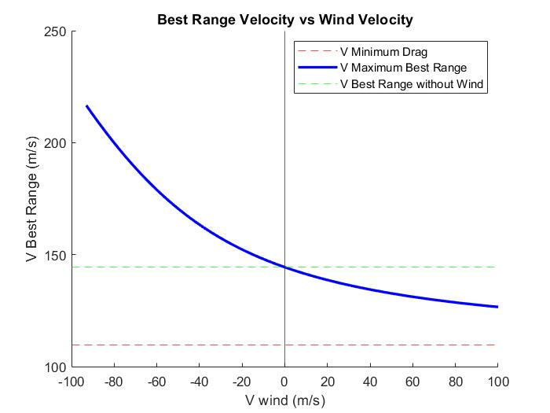
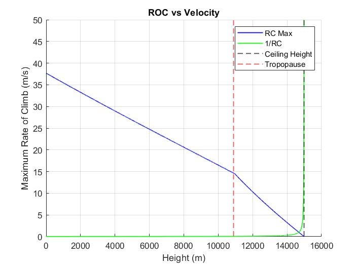

You can change parameters in the Aircraft Properties Section in each code according to the airplane you intend to plot the flight envelope of, the used data in the codes are for Airbus A321

<h1># FlightEnvelope</h1>

This code will plot the flight envelope of an aircraft, it includes maximum, minimum compressibility (speed of sound), and stall speed in different altitudes

<h1># WindVelocity</h1>

This code will plot the best range of speed according to the speed of wind (negative value is head wind and positive is tail wind)

<h1># TurnRate</h1>

This plot will show the range in which the airplane can have the rate of turn for maneuvering

<h1># ROC</h1>

This plot will show the range in which the airplane can have the rate of climb for take-off based on altitude

<h1># ManoeuvreEnvelope</h1>

This plot will show the manoeuvre envelope in which the range of load factor the airplane can withstand in different velocities can be shown

